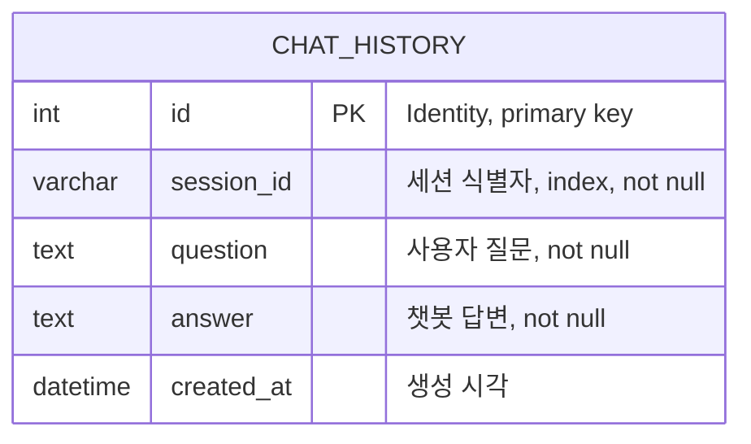
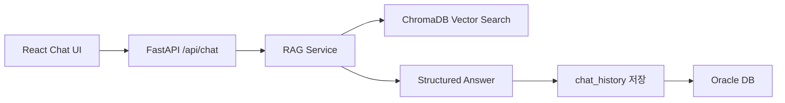
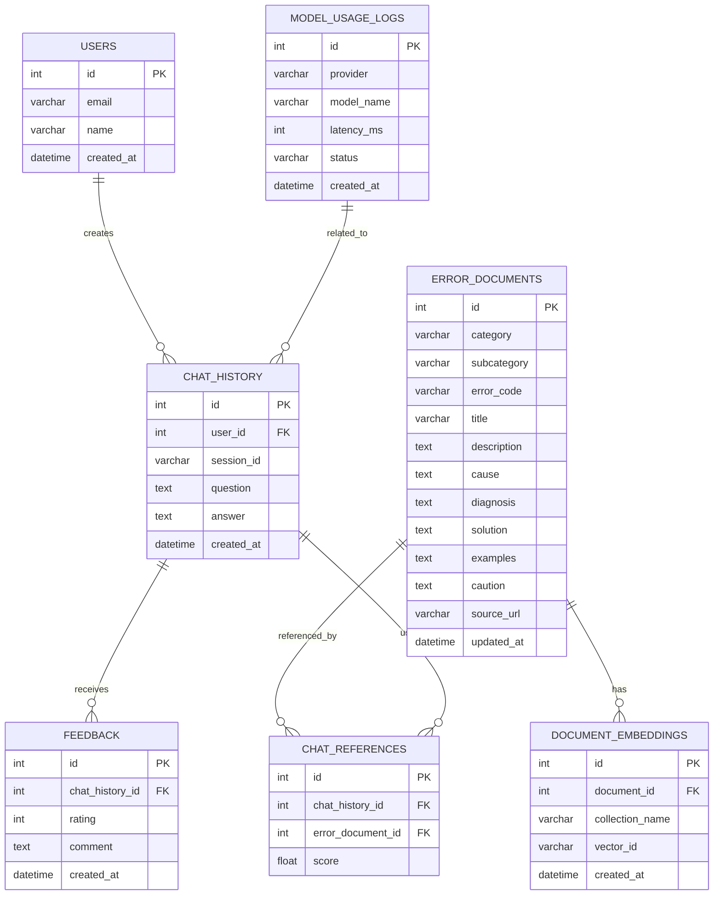

# ERD 문서

## 1. 현재 DB 구조

현재 프로젝트의 DB는 사용자의 질문과 챗봇 답변을 저장하는 `chat_history` 테이블 중심으로 구성되어 있습니다.

오류 문서 원본은 DB 테이블이 아니라 JSON 파일과 ChromaDB 벡터 저장소로 관리됩니다. Oracle DB는 현재 채팅 이력 저장을 담당합니다.

## 2. 현재 ERD



## 3. 테이블 상세

### chat_history

| 컬럼 | 타입 | 제약조건 | 설명 |
|---|---|---|---|
| id | Integer | Primary Key, Identity | 채팅 이력 고유 ID |
| session_id | String(50) | Index, Not Null | 사용자 브라우저 또는 세션별 대화 구분값 |
| question | Text | Not Null | 사용자가 입력한 오류 메시지 또는 질문 |
| answer | Text | Not Null | RAG 검색 기반으로 생성된 챗봇 답변 |
| created_at | DateTime | Default `datetime.utcnow` | 저장 생성 시간 |

## 4. SQLAlchemy 모델

```python
class ChatHistory(Base):
    __tablename__ = 'chat_history'

    id = Column(Integer, Identity(start=1), primary_key=True)
    session_id = Column(String(50), index=True, nullable=False)
    question = Column(Text, nullable=False)
    answer = Column(Text, nullable=False)
    created_at = Column(DateTime, default=datetime.utcnow)
```

## 5. 데이터 흐름



## 6. 현재 구조의 의미

현재 DB는 채팅 이력 저장에 집중되어 있습니다. 오류 문서 원본은 JSON 파일로 관리하고, 검색은 ChromaDB에 저장된 벡터와 metadata를 통해 처리합니다.

이 구조의 장점은 초기 개발 속도가 빠르고, RAG 검색 로직을 DB 설계와 분리해서 테스트하기 쉽다는 점입니다.

다만 운영 서비스로 확장하려면 오류 문서, 검색 근거, 사용자 피드백, 모델 호출 로그를 별도 테이블로 관리하는 것이 좋습니다.

## 7. 확장 ERD 제안

향후 포트폴리오 또는 서비스 고도화 단계에서는 다음 구조로 확장할 수 있습니다.



## 8. 확장 테이블 설명

| 테이블 | 목적 |
|---|---|
| users | 사용자 계정 또는 제출자 정보 관리 |
| chat_history | 질문과 답변 저장 |
| error_documents | 오류 문서 원본을 DB에서 관리 |
| document_embeddings | ChromaDB vector id와 원본 문서 매핑 |
| chat_references | 특정 답변이 어떤 문서를 참고했는지 추적 |
| feedback | 답변 만족도와 개선 의견 수집 |
| model_usage_logs | OpenRouter 등 외부 AI 모델 호출 이력 관리 |

## 9. 포트폴리오 설명용 요약

```text
현재는 chat_history 중심의 단순 ERD로 사용자의 질문과 답변 이력을 저장하고,
오류 문서는 JSON + ChromaDB로 관리했습니다.

향후 운영 단계에서는 error_documents, chat_references, feedback, model_usage_logs를 추가해
문서 관리, 답변 근거 추적, 품질 평가, 모델 호출 분석이 가능한 구조로 확장할 수 있습니다.
```
